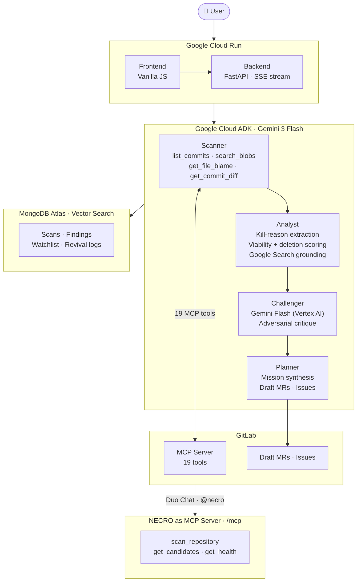

# NECRO: Code Lifecycle Intelligence

Paste a GitLab URL. NECRO reads your repository history and live codebase, then tells you which dead code is safe to delete and which disabled features are worth reviving. Two AI agents argue every finding before a verdict reaches you.

[](LICENSE)
[](https://github.com/google/adk-python)
[](https://ai.google.dev)
[](https://docs.gitlab.com/user/gitlab_duo/model_context_protocol/)
[](https://fastapi.tiangolo.com)
[](https://necro-agent-38381883054.us-central1.run.app)

Every codebase accumulates two kinds of dead weight. Features that were killed for a reason that no longer applies, sitting unshipped while teams rebuild them from scratch. And deprecated code that nobody cleaned up, adding noise and risk to every refactor because nobody is sure what is safe to remove. NECRO surfaces both, verifies every finding against live evidence, and opens the merge request to act on it.

---

## Architecture



Four agents run in sequence on Google Cloud ADK. The Scanner reads GitLab history and live code via 19 MCP tools. The Analyst extracts kill reasons and scores each candidate with Google Search grounding. The Challenger (running on Vertex AI, structurally independent from the Analyst) must produce specific, falsifiable reasons to reject each proposal. The Planner synthesises surviving candidates and, in Mission mode, opens real GitLab Draft MRs.

NECRO also exposes its own MCP endpoint at `/mcp`, so GitLab Duo agents can call it back.

[Full architecture walkthrough](docs/architecture.md) · [Why we built it this way](docs/adr/)

---

## The pipeline

| # | Agent | What it does |
|---|---|---|
| 1 | Scanner | Reads GitLab commits, issues, MRs, and feature flags. Runs `get_file_blame` per line to date deprecation markers. |
| 2 | Analyst | Extracts kill reasons. Calls Google Search to verify whether each constraint was resolved. Scores revival viability and deletion safety. |
| 3 | Challenger | Receives only the proposed action. Must find specific, falsifiable failure reasons. Runs on Vertex AI, independent from the Analyst. |
| 4 | Planner | Ranks surviving candidates, writes the plan, opens Draft MRs and issues via MCP write tools. |

---

## What it does

### Revival: bring back what is worth saving

Find features that were killed for a reason that expired. Every candidate is verified against live external evidence and stress-tested by the adversarial Challenger before you see it. Verdict: Revive Now, Revival Candidate, or Keep Buried.

### Necrosis: excise what has been dead too long

Scan the live codebase for deprecation markers. Each one is dated with `git blame` and checked for active callers via `search_blobs`. NECRO will not suggest removing anything that is still referenced. Verdict: Excise Now, Needs Biopsy, or Leave Intact.

### Mission: let the agent finish the job

Give NECRO one instruction and it runs the full loop autonomously:

```
RECON --> PLAN --> CHALLENGE --> ACT --> VERIFY --> REPORT
```

It scans, plans, has the Challenger red-team the plan, then opens real GitLab Draft MRs with the revival checklist and evidence links written in. A dry-run mode prepares everything without writing.

---

## Stack

| Layer | What is running |
|---|---|
| Agent framework | Google Cloud ADK with SequentialAgent, LlmAgent, FunctionTool, MCPToolset |
| Primary model | Gemini 3 Flash via AI Studio |
| Adversarial model | Gemini Flash via Vertex AI (independent infrastructure) |
| Live verification | Google Search (ADK built-in tool) |
| GitLab integration | Official GitLab MCP Server (SSE) + @zereight/mcp-gitlab (stdio), 19 tools |
| Persistence | MongoDB Atlas with Vector Search |
| Backend | FastAPI + Server-Sent Events, async Python |
| Frontend | Vanilla JS, single-page app |
| Hosting | Google Cloud Run, scales to zero |

---

## Quick start

### Try it live

**[https://necro-agent-38381883054.us-central1.run.app](https://necro-agent-38381883054.us-central1.run.app)**

Instant demo chips load pre-analyzed results in about a second. Live scan chips run the real pipeline in 60 to 120 seconds. Mission Control runs the full autonomous loop.

### Run locally

Prerequisites: Python 3.11+, a MongoDB Atlas account (free tier), a GitLab personal access token with `api` and `read_repository` scope, a Gemini API key, and a Google Cloud project with Vertex AI enabled.

```bash
git clone https://github.com/usv240/necro.git
cd necro
pip install -r requirements.txt
npm install -g @zereight/mcp-gitlab
cp .env.example .env
uvicorn backend.main:app --port 8080 --reload
```

Open `http://localhost:8080`.

```env
GITLAB_TOKEN=glpat-xxxxxxxxxxxx
GEMINI_API_KEY=AIza...
GOOGLE_PROJECT_ID=your-gcp-project-id
MONGODB_URI=mongodb+srv://...
SLACK_WEBHOOK_URL=https://hooks.slack.com/...   # optional
```

### Run tests

```bash
pytest tests/test_necro.py -q          # full suite
pytest tests/test_necro.py -m unit     # no server needed
```

---

## API

| Method | Endpoint | What it does |
|--------|----------|--------------|
| `POST` | `/api/scan/stream` | Revival scan, SSE stream |
| `POST` | `/api/scan/demo` | Load a cached revival scan |
| `POST` | `/api/scan/group` | Scan an entire GitLab namespace |
| `POST` | `/api/necrosis/scan` | Dead-code scan, SSE stream |
| `POST` | `/api/necrosis/demo` | Load a cached necrosis scan |
| `POST` | `/api/agent/mission` | Autonomous mission, SSE stream |
| `GET`  | `/api/agent/mission/latest` | Replay the most recent mission |
| `POST` | `/api/revive/{id}` | Create a revival issue |
| `POST` | `/api/revive/{id}/ghost-mr` | Branch + plan file + Draft MR |
| `POST` | `/api/necrosis/{id}/deletion-mr` | Branch + deletion plan + Draft MR |
| `GET`  | `/api/health` | Full stack status |
| `POST` | `/mcp` | NECRO's own MCP endpoint |

---

## Project layout

```
necro/
├── docs/
│   ├── architecture.md             # Full system architecture and data flow
│   └── adr/                        # Architecture decision records
├── agent/                          # ADK agent and system prompt
├── backend/
│   ├── main.py
│   ├── routes/
│   │   ├── stream.py               # Revival SSE scan
│   │   ├── scan.py                 # Background and cached demo scans
│   │   ├── necrosis.py             # Dead-code scan and deletion MR
│   │   ├── agent.py                # ADK ask, autonomous mission, webhook
│   │   └── revive.py               # Revival issue and Ghost MR
│   └── services/
│       ├── git_forensics.py        # Dead-feature detection (history)
│       ├── necrosis_detector.py    # Dead-code detection (live codebase)
│       ├── death_reason.py         # Kill-reason classification
│       ├── viability_scorer.py     # Revival scoring
│       ├── deletion_scorer.py      # Deletion-safety scoring
│       ├── constraint_grounder.py  # npm, GitHub, PyPI verification
│       ├── challenger.py           # Adversarial agent
│       └── mission.py              # Autonomous closed-loop orchestrator
├── frontend/                       # Single-page app
├── tests/                          # Unit and integration suite
├── .gitlab/duo/necro-agent.yaml    # Duo Agent Platform registration
├── .gitlab-ci.yml
└── LICENSE
```

---

## Contact

Ujwal Suresh: ujwalsureshv@gmail.com

---

## License

[Apache 2.0](./LICENSE)
