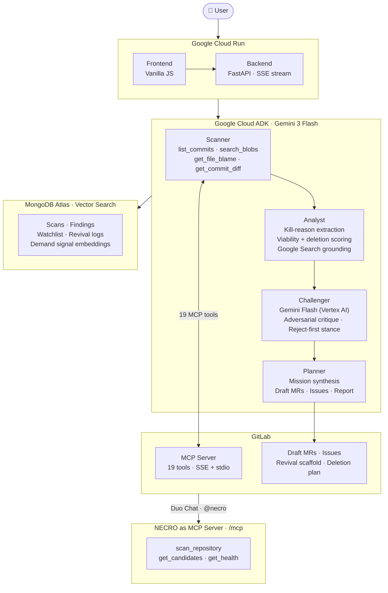

# NECRO: System Architecture

## How it works

You paste a GitLab URL. NECRO sends it through a pipeline of four agents, each with a focused job. The Scanner reads your repository's history and live codebase via GitLab MCP tools. The Analyst extracts kill reasons and scores each candidate. The Challenger argues against every proposal from a position of rejection. The Planner synthesises what survived and, if you are in Mission mode, opens real GitLab Draft MRs and issues on your behalf.

Every finding is grounded against live evidence before it reaches you. Google Search confirms whether the original blocker still applies. GitLab `search_blobs` confirms whether code still has active callers before NECRO ever suggests deleting it. Nothing is presented as a verdict without a source.

---

## Diagram



---

## The pipeline

| # | Agent | What it does |
|---|---|---|
| 1 | Scanner | Reads GitLab commit history, issues, merge requests, and feature flags via 19 MCP tools. Runs `get_file_blame` per line to date deprecation markers for the Necrosis scan. |
| 2 | Analyst | Extracts kill reasons from commit messages and issue threads. Calls Google Search to verify whether each constraint was resolved and when. Scores revival viability and deletion safety. |
| 3 | Challenger | Receives only the proposed action, not the Analyst's reasoning. Must produce specific, falsifiable reasons the action will fail. Runs on Vertex AI, structurally independent from the Analyst. |
| 4 | Planner | Ranks surviving candidates, writes the mission plan, and opens real GitLab Draft MRs and issues via MCP write tools when Mission mode is active. |

---

## A real example

Here is what happens when you scan `gitlab-org/gitlab-pages` with the Dormant Feature Registry:

1. Scanner calls `list_commits` and `get_commit_diff` on 200 commits. It finds a commit disabling `FF_ENABLE_DOMAIN_REDIRECT`.
2. Analyst reads the commit message and linked issue. The feature was disabled due to a DNS subdomain takeover risk. It calls Google Search: GitLab Pages domain verification shipped in 16.x and directly addresses the attack vector.
3. Challenger receives: "Propose reviving FF_ENABLE_DOMAIN_REDIRECT." It argues: wildcard cert provisioning via Let's Encrypt DNS-01 challenge has edge cases; rate limiting on domain verification needs design. These are real risks, not hallucinated objections, so the verdict is downgraded from Revive Now to Revival Candidate.
4. Planner ranks this alongside other findings and produces the report. If Mission mode is on, it opens a Draft MR on your target repo with the revival checklist and evidence links already written in.

---

## Two registries, one engine

NECRO runs the same agent pipeline in two directions.

```
  shipped --> killed -----> is the kill reason still valid? --> REVIVE
                    |
                    +------> deprecated but never deleted?  --> EXCISE
```

The Dormant Feature Registry reads commit history for disablement patterns. The Necrosis Registry reads the live codebase for deprecation markers and confirms zero active callers before suggesting anything is safe to remove. The detection step differs; the analysis pipeline is shared.

This matters because revival is rare and dead code is universal. Every mature codebase has deprecated functions that nobody cleaned up. Having both registries in the same tool means every scan produces something useful, even when no revival candidates exist.

---

## GitLab integration: bidirectional MCP

NECRO does not just call GitLab. GitLab can call NECRO back.

```
NECRO ------calls------> GitLab MCP Server
                         (list_commits, search_blobs, create_merge_request, ...)

GitLab Duo  <--calls---  NECRO MCP Server at /mcp
                         (scan_repository, get_candidates, get_health)
```

NECRO's MCP server is built with FastMCP and mounted at `/mcp` on the same FastAPI application. A developer can register it in GitLab Duo Agent Platform via `.gitlab/duo/necro-agent.yaml` and trigger the full pipeline with `@necro` in Duo Chat without leaving GitLab.

---

## What each layer does

**Google Cloud Run** hosts the frontend and backend API. The backend streams live updates to the browser as each agent completes its work, so you watch the pipeline run in real time rather than waiting on a spinner.

**Google Cloud ADK** orchestrates the four-agent sequence. Agents share state through a session object so a downstream agent can see everything upstream agents found without re-calling any APIs.

**GitLab MCP Server** provides 19 tools across two independent connections (official SSE server and the `@zereight/mcp-gitlab` stdio server). NECRO uses the official server for write operations (creating merge requests and issues) because it has stricter authorization controls.

**Google Search** is used by the Analyst as a built-in ADK tool to verify whether the constraint that killed a feature was later resolved. Every "what changed" claim is backed by a live URL and release date, labelled either "verified" or "AI-inferred."

**MongoDB Atlas** stores scan history, findings, watchlist entries, and revival logs. Vector Search on the `features` collection enables semantic matching between new candidates and historical demand signals.

**Vertex AI** runs the Challenger on separate infrastructure from the Analyst. The independence is structural: different model, different serving backend, different temperature sampling.

---

## Technology choices

| Component | Technology | Why |
|---|---|---|
| Agent orchestration | Google Cloud ADK | Multi-tool agents with MCP toolset, transparent reasoning trace |
| Primary model | Gemini 3 Flash (AI Studio) | Analysis, grounding, planning, mission loop |
| Adversarial model | Gemini Flash (Vertex AI) | Structurally independent from the primary |
| Live verification | Google Search (ADK built-in tool) | Citable URLs, not training-data guesses |
| GitLab integration | Official GitLab MCP Server + @zereight/mcp-gitlab | 19 tools, full read and write access |
| Persistence | MongoDB Atlas with Vector Search | Document-shaped data, semantic demand matching |
| Streaming | FastAPI + Server-Sent Events | Async, one-directional, no protocol upgrade |
| Hosting | Google Cloud Run | Serverless, scales to zero |

---

## Why we made the decisions we did

See [docs/adr/](adr/) for the reasoning behind the key design choices.

- [ADR-0001](adr/0001-multi-agent-architecture.md): Three separate models instead of one
- [ADR-0002](adr/0002-adversarial-challenger-infrastructure.md): The Challenger runs on separate infrastructure
- [ADR-0003](adr/0003-gitlab-mcp-over-rest.md): GitLab MCP over direct REST API calls
- [ADR-0004](adr/0004-mongodb-atlas.md): MongoDB Atlas for persistence and vector search
- [ADR-0005](adr/0005-necro-as-mcp-server.md): NECRO exposes its own MCP endpoint
- [ADR-0006](adr/0006-sse-streaming.md): Server-Sent Events for real-time output
- [ADR-0007](adr/0007-dual-registry-design.md): Two registries, one shared engine
